# rhsummit-24-java-ocp

## 1. Start Red Hat Developer Sandbox

Click on [Red Hat Developer Sandbox](https://developers.redhat.com/developer-sandbox?target=_blank)

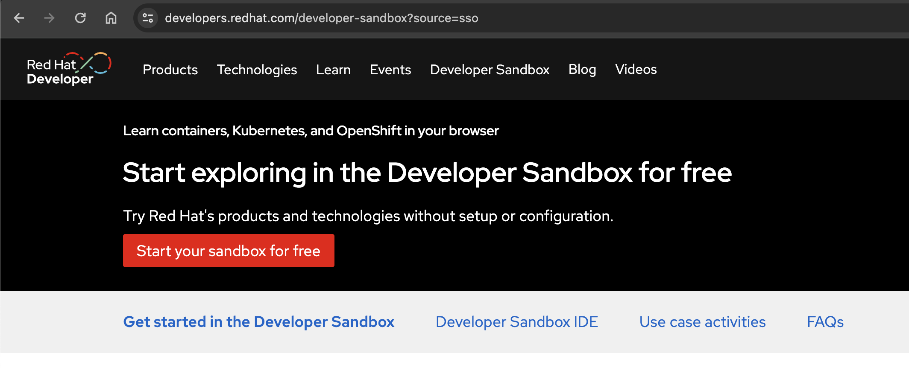

It take a few minutes to complete the registration after your email validation. Once you register it, you will end up this page.

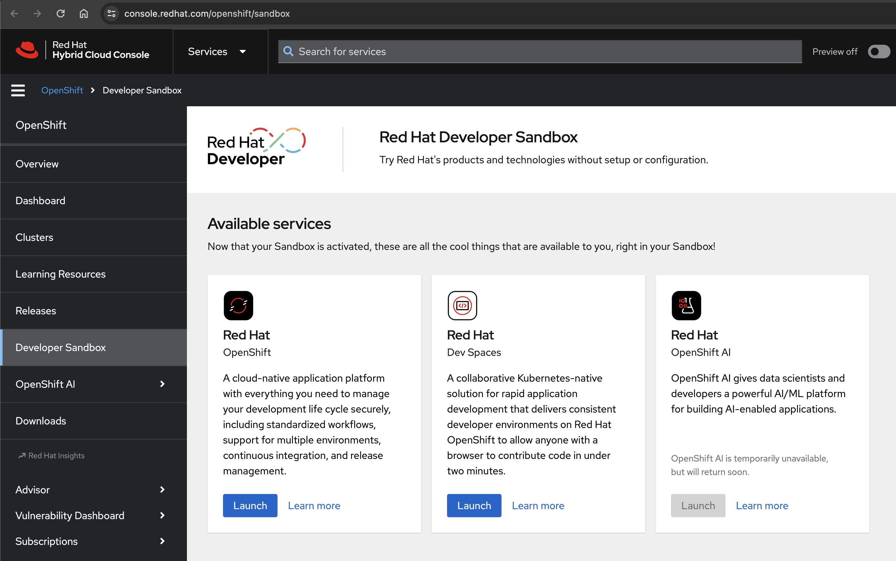

Click on `Launch` in the Red Hat Dev Spaces tile.

## 2. Start Red Hat Dev Spaces (Cloud IDE)

Click on `Empty Workspace`.

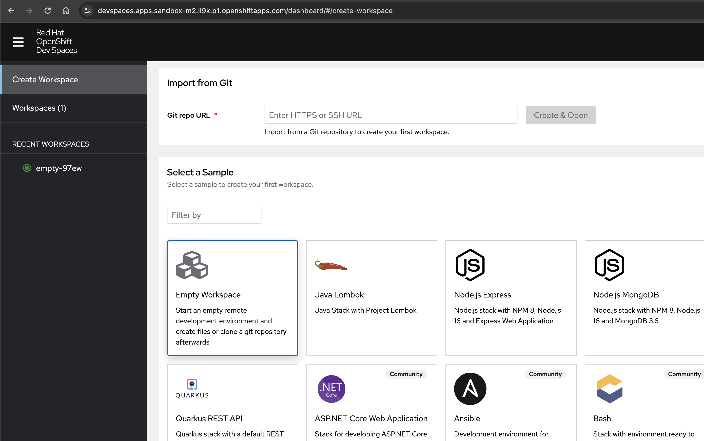

A new workspace is started below:

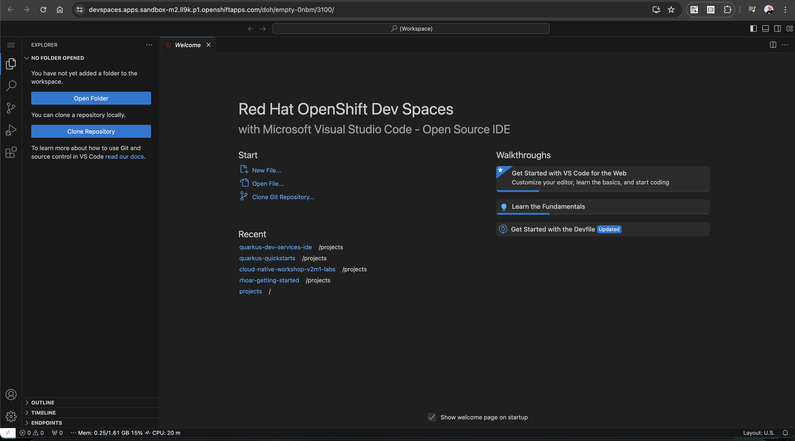

## 3. Install Quarkus CLI

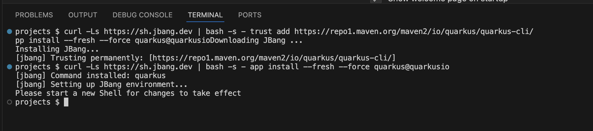

Run the following `curl` command in the terminal.

```
curl -Ls https://sh.jbang.dev | bash -s - trust add https://repo1.maven.org/maven2/io/quarkus/quarkus-cli/
curl -Ls https://sh.jbang.dev | bash -s - app install --fresh --force quarkus@quarkusio
```

Close the terminal and `open` a new terminal.

Verify the Quarkus CLI.

```
quarkus version
```

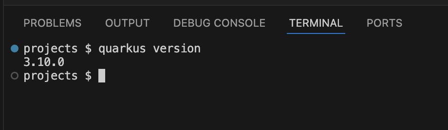


## 4. Create a new Quarkus project

Run the following Quarkus CLI in the terminal.

```
quarkus create app java-me-smarter
```

## 5. Start Live Coding

Add the following the configuration to the `application.properties`.

The changes will be saved automatically.

```
quarkus.http.host=0.0.0.0
quarkus.dev-ui.cors.enabled=false
```

Run the follwoing the Quarkus CLI in the terminal.

```
quarkus dev
```

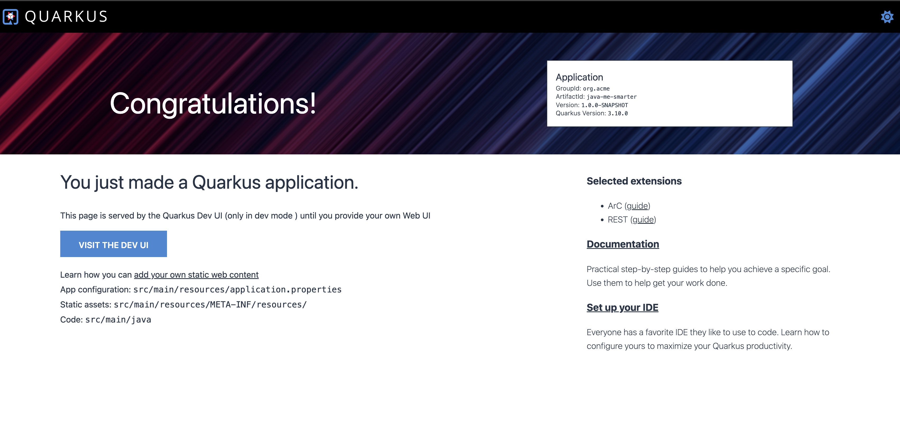

## 6. Add Quarkus OpenShift extension

Run the following Quarkus CLI in the terminal.

```
quarkus ext add openshift
```

Add the following OpenShift configuration to the `application.properties`.

```
quarkus.kubernetes.deploy=true
quarkus.kubernetes.deploy-target=openshift
quarkus.openshift.route.expose=true
quarkus.kubernetes-client.trust-certs=true
```

This will generate all required OpenShift manifests (e.g., *openshift.yaml*).

## 7. Deploy Java app to OpenShift

Make sure to stop the Quarkus Dev Mode by prsessing `Ctrl + C`.

Run the following Quarkus CLI in the terminal.

```
quarkus build --no-tests
```

It takes a few minutes to complete the process.

```
....
[INFO] --- failsafe:3.2.5:integration-test (default) @ java-me-smarter ---
[INFO] Tests are skipped.
[INFO] 
[INFO] --- failsafe:3.2.5:verify (default) @ java-me-smarter ---
[INFO] Tests are skipped.
[INFO] 
[INFO] --- install:3.1.1:install (default-install) @ java-me-smarter ---
Downloading from central: https://repo.maven.apache.org/maven2/org/codehaus/plexus/plexus-utils/3.5.0/plexus-utils-3.5.0.jar
Downloaded from central: https://repo.maven.apache.org/maven2/org/codehaus/plexus/plexus-utils/3.5.0/plexus-utils-3.5.0.jar (267 kB at 13 MB/s)
[INFO] Installing /projects/java-me-smarter/pom.xml to /home/user/.m2/repository/org/acme/java-me-smarter/1.0.0-SNAPSHOT/java-me-smarter-1.0.0-SNAPSHOT.pom
[INFO] Installing /projects/java-me-smarter/target/java-me-smarter-1.0.0-SNAPSHOT.jar to /home/user/.m2/repository/org/acme/java-me-smarter/1.0.0-SNAPSHOT/java-me-smarter-1.0.0-SNAPSHOT.jar
[INFO] ------------------------------------------------------------------------
[INFO] BUILD SUCCESS
[INFO] ------------------------------------------------------------------------
[INFO] Total time:  01:40 min
[INFO] Finished at: 2024-05-01T01:23:05Z
[INFO] ------------------------------------------------------------------------
```

## 8. Access OpenShift cluster

Access the OpenShift cluster by clicking `Launch` in the Red Hat OpenShift tile.

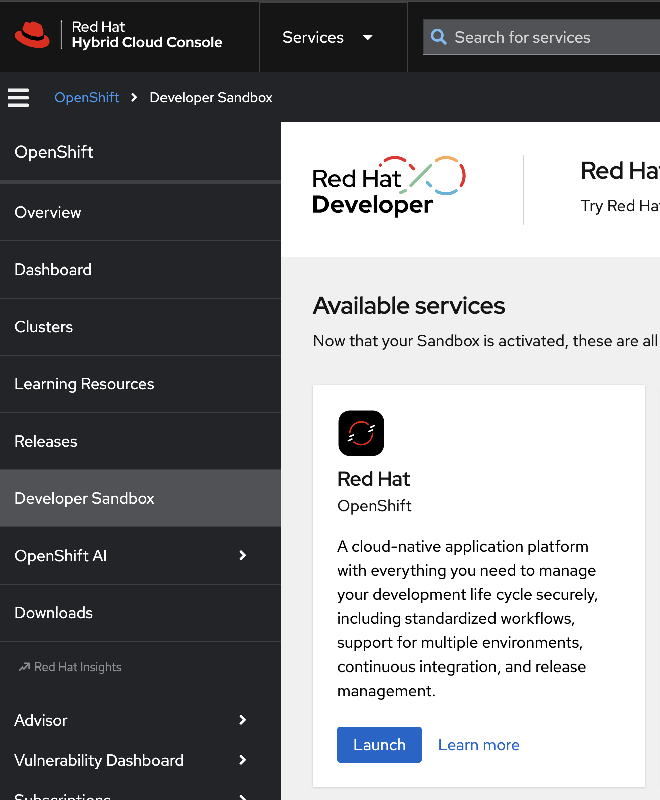

Log in with `DevSandbox`.

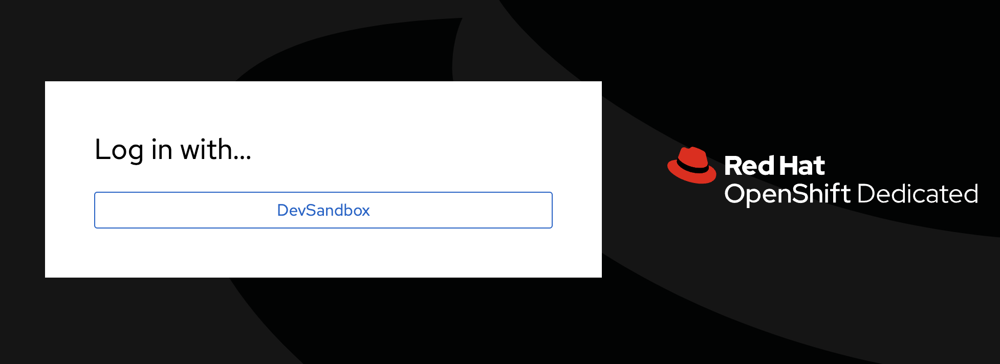

In `Topology` view, you will see the running `java-me-smarter` pod.

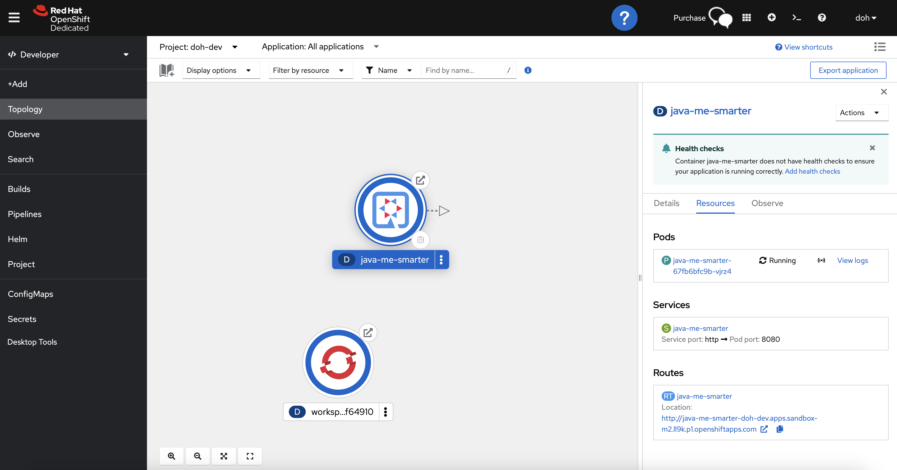

Try to access the REST API by accessing the `ROUTE` URL.

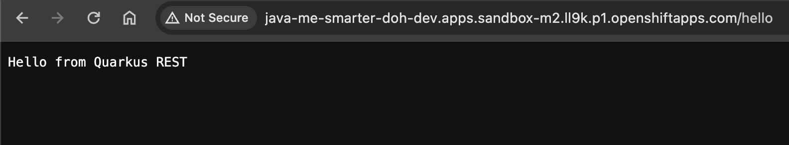

## Congratulations!!

Keep going your cloud-native application development journey with Quarkus and OpenShift!